# 🚆 Online Reservation System

A desktop-based **Online Reservation System** developed using **Java Swing, JDBC, MySQL, and Maven**.

This project was developed as part of the **Oasis Infobyte Java Development Internship** under the **Java Development** domain.

The system provides a graphical interface through which users can log in, view available trains, make reservations, search reservations using a PNR number, cancel reservations, and log out.

---

## 📌 Project Overview

The Online Reservation System is a Java desktop application designed to simplify the process of railway reservation management.

The application uses:

- **Java Swing** for the graphical user interface
- **JDBC** for connecting Java with MySQL
- **MySQL** for storing users, trains, and reservation information
- **Maven** for project and dependency management

The application follows a structured architecture using:

- Model classes
- DAO classes
- Database connection class
- Swing UI classes

---

## 🎯 Project Objective

The main objective of this project is to develop a simple and functional railway reservation system that allows users to:

1. Login securely using application credentials.
2. Access a reservation dashboard.
3. View available trains.
4. Enter passenger information.
5. Select a train and travel class.
6. Book a railway reservation.
7. Generate a unique PNR number.
8. Search an existing reservation using its PNR.
9. Cancel an existing reservation.
10. Logout from the application.

---

# ✨ Features

## 🔐 User Authentication

- User login system
- Username and password validation
- Invalid login handling
- Logout functionality

## 🏠 Dashboard

After successful login, the user is taken to the main dashboard.

The dashboard provides access to:

- Book Reservation
- Search Reservation
- Cancel Reservation
- Logout

## 🚆 Train Reservation

Users can:

- Enter passenger name
- Select a train
- Select travel class
- Enter journey date
- Enter source station
- Enter destination station
- Book the reservation

## 🎫 PNR Generation

After successful booking, the system generates a unique PNR number and displays the reservation information.

## 🔎 Reservation Search

Users can enter a PNR number to retrieve reservation details such as:

- Passenger name
- Train number
- Train name
- Class
- Journey date
- Source station
- Destination station

## ❌ Reservation Cancellation

Users can:

1. Enter a PNR.
2. Search for the reservation.
3. View reservation details.
4. Confirm cancellation.
5. Cancel the reservation from the database.

## 🗄️ MySQL Database

The application stores data in MySQL.

The database contains:

- `users`
- `trains`
- `reservations`

## 🖥️ Graphical User Interface

The application is developed using Java Swing and provides separate screens for:

- Login
- Dashboard
- Reservation
- Search/Cancellation

---

# 🛠️ Technologies Used

| Technology | Purpose |
|---|---|
| Java | Core application development |
| Java Swing | Graphical User Interface |
| JDBC | Java-MySQL connectivity |
| MySQL | Database management |
| MySQL Workbench | Database development and testing |
| Maven | Build and dependency management |
| Git | Version control |
| GitHub | Source code hosting |
| Visual Studio Code | Development environment |

---

# 🏗️ Project Architecture

The project follows a simple layered architecture.

```text
                    ┌─────────────────────┐
                    │       Main.java     │
                    └──────────┬──────────┘
                               │
                               ↓
                    ┌─────────────────────┐
                    │      UI Layer       │
                    │    Java Swing       │
                    ├─────────────────────┤
                    │ LoginFrame          │
                    │ DashboardFrame      │
                    │ ReservationFrame    │
                    │ CancellationFrame  │
                    └──────────┬──────────┘
                               │
                               ↓
                    ┌─────────────────────┐
                    │      DAO Layer      │
                    ├─────────────────────┤
                    │ UserDAO             │
                    │ TrainDAO            │
                    │ ReservationDAO      │
                    └──────────┬──────────┘
                               │
                               ↓
                    ┌─────────────────────┐
                    │ Database Connection │
                    │       JDBC          │
                    └──────────┬──────────┘
                               │
                               ↓
                    ┌─────────────────────┐
                    │       MySQL         │
                    │ oibsip_reservation  │
                    └─────────────────────┘
```

---

# 📁 Project Folder Structure

```text
Java-Task1-OnlineReservationSystem/
│
├── database/
│   └── oibsip_reservation.sql
│
├── screenshots/
│   ├── 01-loginPage.png
│   ├── 02-loginSuccess.png
│   ├── 03-Dashboard.png
│   ├── 04-ReservationPage.png
│   ├── 05-ReservationSuccess.png
│   ├── 06-SearchReservation.png
│   ├── 07-ReservationCancelPage.png
│   ├── 08-ReservationCancelSuccess.png
│   ├── 09-logoutPage.png
│   ├── 10-loginFailPage.png
│   ├── 11-mySqlDatabase.png
│   ├── 12-mySqlTrains.png
│   └── 13-mySqlReservations.png
│
├── src/
│   └── main/
│       └── java/
│           └── com/
│               └── oibsip/
│                   └── reservation/
│                       │
│                       ├── Main.java
│                       │
│                       ├── database/
│                       │   └── DatabaseConnection.java
│                       │
│                       ├── model/
│                       │   ├── User.java
│                       │   ├── Train.java
│                       │   └── Reservation.java
│                       │
│                       ├── dao/
│                       │   ├── UserDAO.java
│                       │   ├── TrainDAO.java
│                       │   └── ReservationDAO.java
│                       │
│                       └── ui/
│                           ├── LoginFrame.java
│                           ├── DashboardFrame.java
│                           ├── ReservationFrame.java
│                           └── CancellationFrame.java
│
├── .gitignore
├── pom.xml
└── README.md
```

---

# 📂 Important Files

### `Main.java`

The main entry point of the application.

It starts the Java Swing application and opens the login screen.

### `DatabaseConnection.java`

Responsible for creating a JDBC connection between the Java application and MySQL database.

### `User.java`

Model class representing application users.

### `Train.java`

Model class representing available trains.

### `Reservation.java`

Model class representing reservation information.

### `UserDAO.java`

Handles user-related database operations.

### `TrainDAO.java`

Handles train-related database operations.

### `ReservationDAO.java`

Handles reservation-related database operations including:

- Booking
- Searching
- Cancellation
- PNR generation

### `LoginFrame.java`

Provides the login interface.

### `DashboardFrame.java`

Provides the main application dashboard.

### `ReservationFrame.java`

Provides the railway reservation form.

### `CancellationFrame.java`

Provides reservation search and cancellation functionality.

---

# 🗄️ Database

The application uses MySQL database:

```text
oibsip_reservation
```

## Database Tables

### 1. Users Table

The `users` table stores application login information.

```text
id
username
password
```

### 2. Trains Table

The `trains` table stores available train information.

```text
train_number
train_name
```

### 3. Reservations Table

The `reservations` table stores passenger reservation information.

```text
pnr
passenger_name
train_number
train_name
class_type
journey_date
source_station
destination_station
```

---

# 🔗 Database Relationship

The `reservations` table contains a foreign key referencing the `trains` table.

```text
trains
   │
   │ train_number
   │
   ↓
reservations
```

This allows each reservation to be associated with a valid train.

---

# ⚙️ Requirements

Before running the project, make sure the following software is installed:

- Java JDK 17 or later
- MySQL Server
- MySQL Workbench
- Apache Maven
- Git
- Visual Studio Code or another Java IDE

---

# 🚀 Installation and Setup

## Step 1 — Clone the Repository

```bash
git clone YOUR_GITHUB_REPOSITORY_URL
```

Replace `YOUR_GITHUB_REPOSITORY_URL` with the GitHub repository URL.

Then enter the project directory:

```bash
cd Java-Task1-OnlineReservationSystem
```

---

## Step 2 — Set Up MySQL

Open **MySQL Workbench** and connect to your local MySQL server.

Open the SQL file:

```text
database/oibsip_reservation.sql
```

Execute the SQL script.

The script creates:

```text
oibsip_reservation
```

and the following tables:

```text
users
trains
reservations
```

---

## Step 3 — Configure Database Connection

Open:

```text
src/main/java/com/oibsip/reservation/database/DatabaseConnection.java
```

Configure the MySQL connection according to your local MySQL installation.

Make sure:

- MySQL Server is running
- Host is correct
- Port is correct
- Database name is correct
- MySQL username is correct
- MySQL password is correctly configured

> Do not commit your real MySQL password or other sensitive credentials to GitHub.

---

# 🔑 Demo Login

The project contains a demo application account for testing.

```text
Username: admin
Password: admin123
```

These credentials are for the application login and are not the MySQL root credentials.

---

# 🔨 Build the Project

Open PowerShell or Command Prompt in the project root directory.

Run:

```bash
mvn clean compile
```

If the compilation is successful, Maven will display:

```text
BUILD SUCCESS
```

---

# ▶️ Run the Application

Run:

```bash
mvn exec:java -Dexec.mainClass="com.oibsip.reservation.Main"
```

The application will start and display the login window.

---

# 🔄 Application Workflow

```text
                 ┌───────────────┐
                 │     Login     │
                 └───────┬───────┘
                         │
                  Valid Credentials
                         │
                         ↓
                 ┌───────────────┐
                 │   Dashboard   │
                 └───────┬───────┘
                         │
             ┌───────────┼───────────┐
             │           │           │
             ↓           ↓           ↓
          Booking      Search      Logout
             │           │
             ↓           ↓
        Reservation   Reservation
             │           │
             ↓           ↓
          Generate     Display
            PNR        Details
             │           │
             └─────┬─────┘
                   ↓
              Cancellation
```

---

# 🎫 Reservation Workflow

```text
Login
  ↓
Dashboard
  ↓
Book Reservation
  ↓
Enter Passenger Name
  ↓
Select Train
  ↓
Select Class
  ↓
Enter Journey Date
  ↓
Enter Source
  ↓
Enter Destination
  ↓
Book Reservation
  ↓
PNR Generated
  ↓
Reservation Saved in MySQL
```

---

# ❌ Cancellation Workflow

```text
Dashboard
   ↓
Search / Cancel Reservation
   ↓
Enter PNR
   ↓
Search
   ↓
Reservation Found
   ↓
Display Details
   ↓
Cancel Reservation
   ↓
Confirmation
   ↓
Reservation Deleted
```

---

# 📸 Application Screenshots

The following screenshots demonstrate the actual working application.

## Login Page

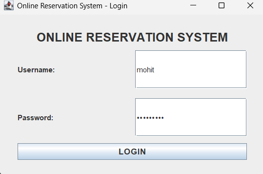

---

## Successful Login

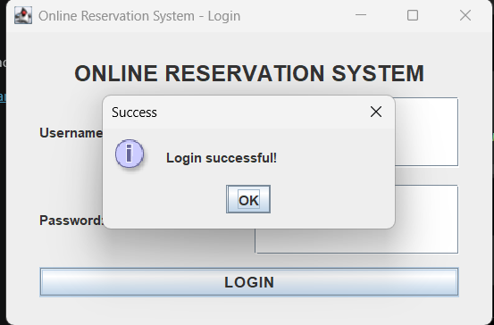

---

## Dashboard

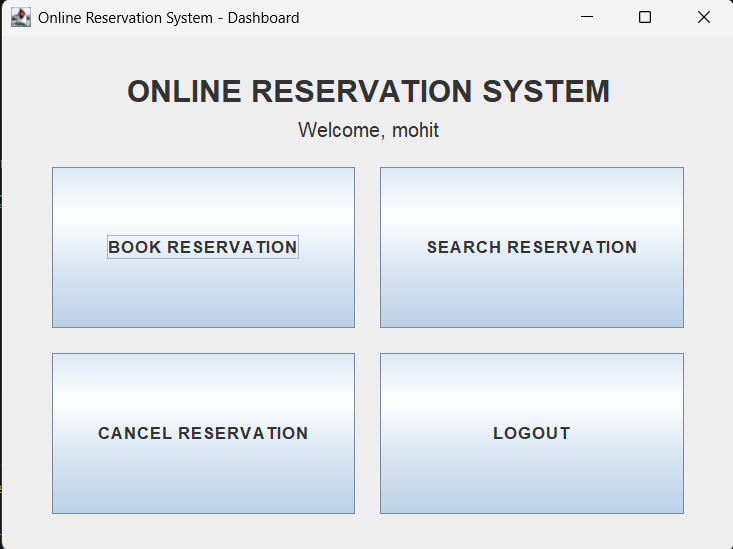

---

## Reservation Page

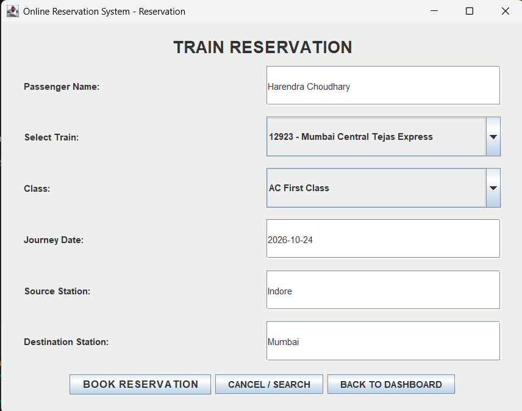

---

## Reservation Successful

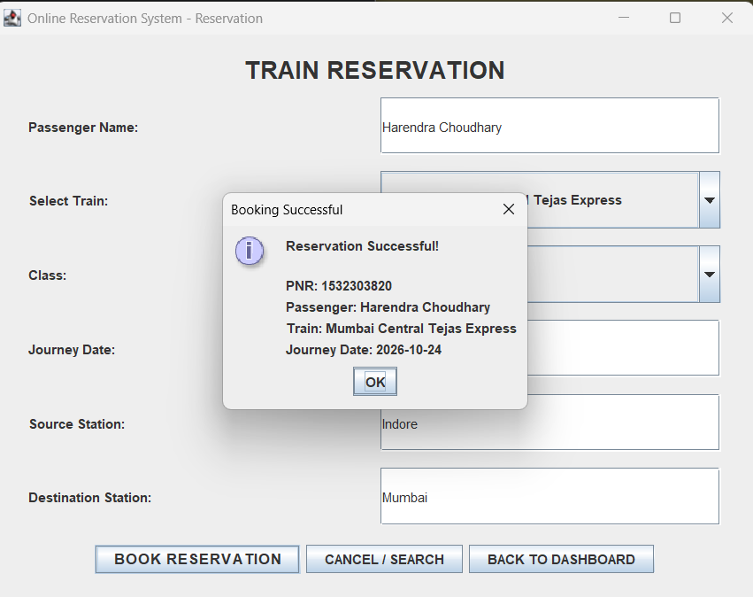

---

## Search Reservation

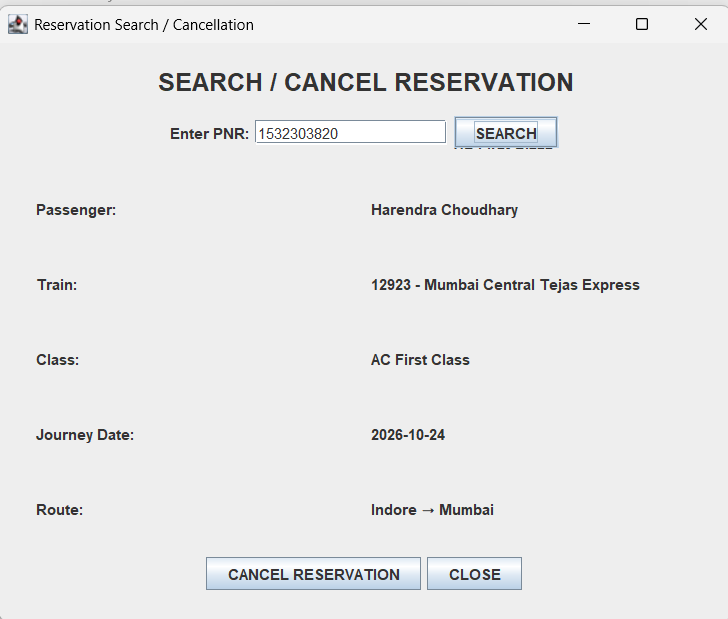

---

## Reservation Cancellation Page

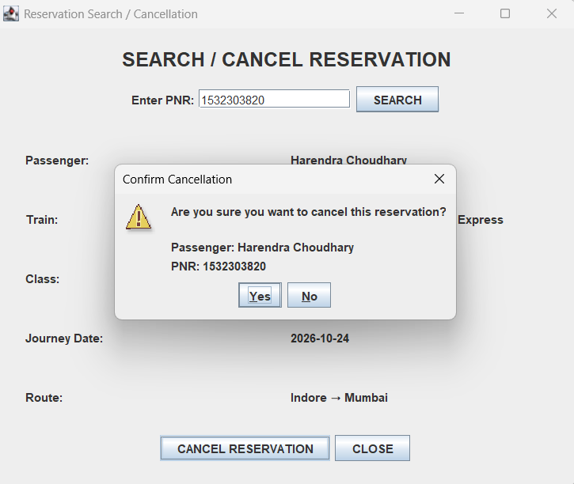

---

## Reservation Cancellation Successful

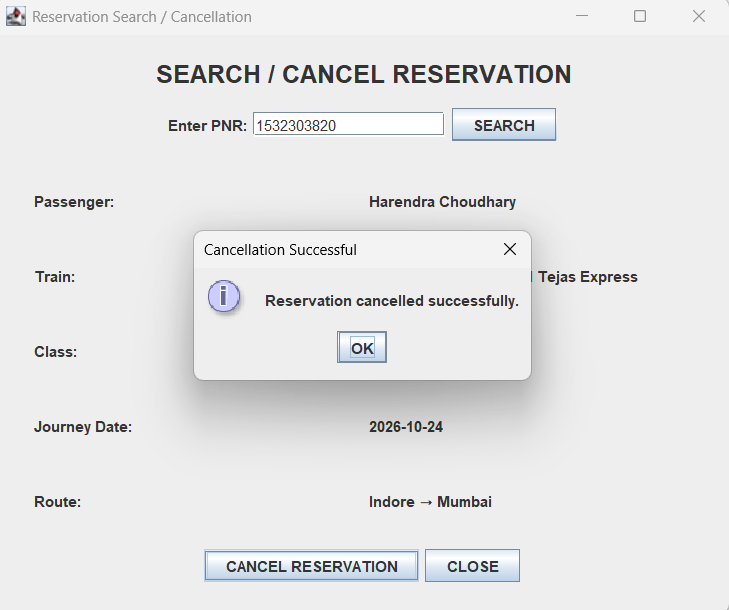

---

## Logout

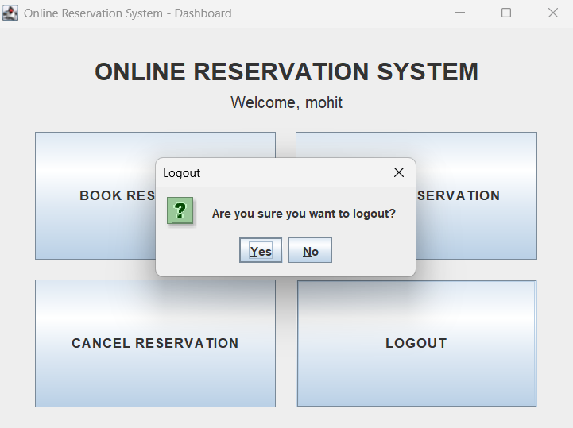

---

## Login Failure Handling

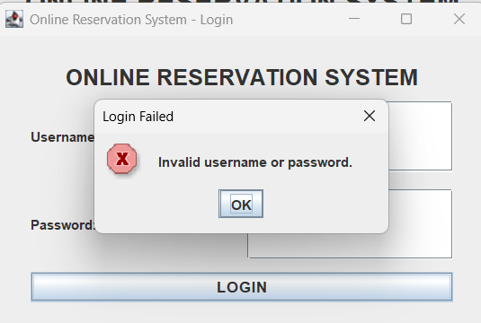

---

# 🗃️ MySQL Screenshots

## Database Structure

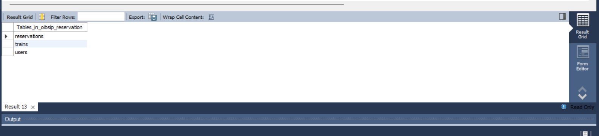

---

## Train Records

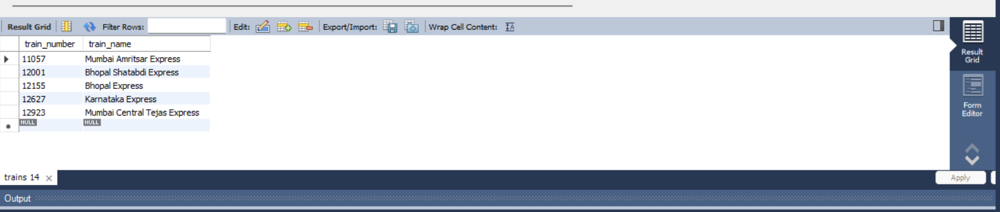

---

## Reservation Records

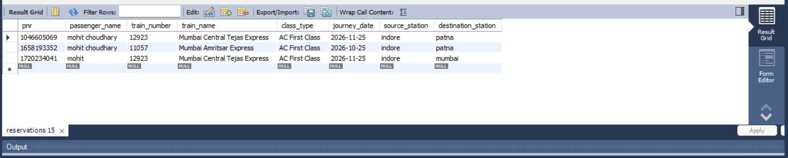

---

# 🧪 Testing

The application was tested for the following scenarios:

| Test Case | Expected Result |
|---|---|
| Valid username and password | Login successful |
| Invalid username/password | Login failure message |
| Empty reservation fields | Validation message |
| Invalid journey date | Date validation message |
| Valid reservation details | Reservation created |
| Reservation booking | PNR generated |
| Valid PNR search | Reservation details displayed |
| Invalid PNR | Reservation not found |
| Reservation cancellation | Reservation removed |
| Logout | Returned to login screen |

---

# 🔒 Security Notes

This project is intended for educational and internship purposes.

Important security practices:

- Do not upload real database passwords.
- Do not upload personal credentials.
- Do not commit `.env` files.
- Do not expose sensitive database configuration.
- The demo login credentials are only for testing the application.

---

# 🧹 `.gitignore`

The project includes a `.gitignore` file to prevent unnecessary files such as:

```text
target/
*.class
.vscode/
.idea/
.env
```

from being uploaded to GitHub.

---

# 📦 Maven

Maven is used to:

- Manage project dependencies
- Compile Java source code
- Clean generated files
- Build the project

The Maven configuration is available in:

```text
pom.xml
```

---

# 🧩 Key Concepts Demonstrated

This project demonstrates practical use of:

- Java Object-Oriented Programming
- Classes and Objects
- Encapsulation
- Java Swing
- Event Handling
- JDBC
- SQL
- MySQL
- CRUD database operations
- DAO Pattern
- Model Classes
- Exception Handling
- Input Validation
- Maven
- Git
- GitHub

---

# 📚 Learning Outcomes

Through this project, the following concepts were practiced:

- Developing a Java desktop application
- Creating graphical interfaces using Swing
- Connecting Java applications to MySQL
- Executing SQL queries using JDBC
- Designing relational database tables
- Working with primary and foreign keys
- Implementing database CRUD operations
- Structuring a Java project using packages
- Managing dependencies using Maven
- Using Git for version control
- Preparing and documenting a project for GitHub

---

# 📝 Internship Information

**Organization:** Oasis Infobyte

**Internship Domain:** Java Development

**Task:** Online Reservation System

**Project Type:** Java Desktop Application

---

# 👨‍💻 Author

**Mohit Choudhary**

Java Development Intern

---

# ⭐ Acknowledgement

This project was developed as part of the **Oasis Infobyte Java Development Internship**.

The project provided practical experience in Java development, database integration, GUI development, JDBC, Maven, and Git/GitHub.

---

# 📄 License

This project is created for educational and internship purposes.